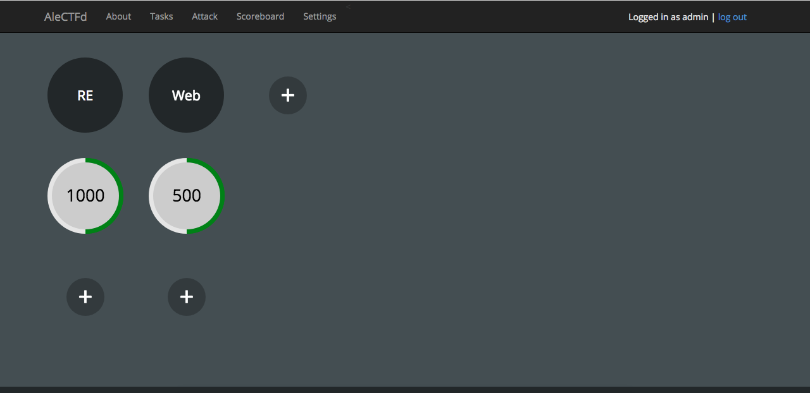
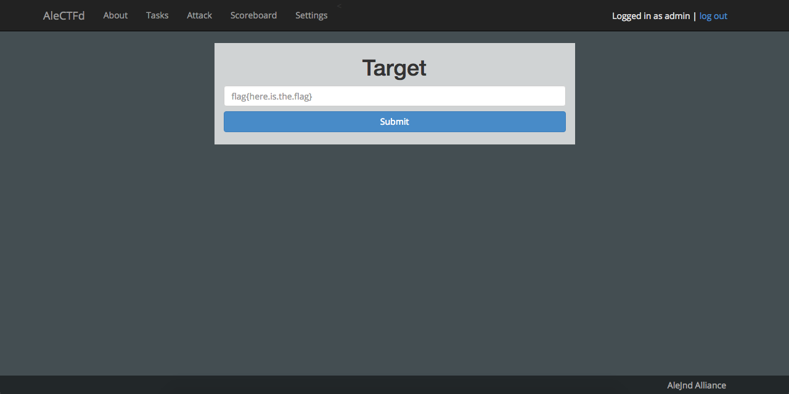

AleJndCTF
================

`AleJndCTF` is a fork of another open-source (jeopardy style) CTF platform called the [tinyctf-platform](https://github.com/balidani/tinyctf-platform).
This fork also contains part of the implementations from [internetwache](https://github.com/internetwache/tinyctf-platform) and [gartnera](https://github.com/gartnera/tinyctf-platform) forked version.

#### Jeopardy


#### Attack and Defense


#### Usage

```bash
$ pip install -r requirements.txt
$ ./buildTables.sh
$ python server.py
```

For Attack and Defense mode. Please refer [here](https://github.com/alejndalliance/AleJndFlag).

#### TODO

```bash
$ cd /path/to/AleJndCTF
$ grep -RE "TODO|FIXME|NOTE" .
```

#### Contact

mohdfakhrizulkifli at gmail dot com.

*Note*: Flask should run on top of a proper web server if you plan to have many players.
